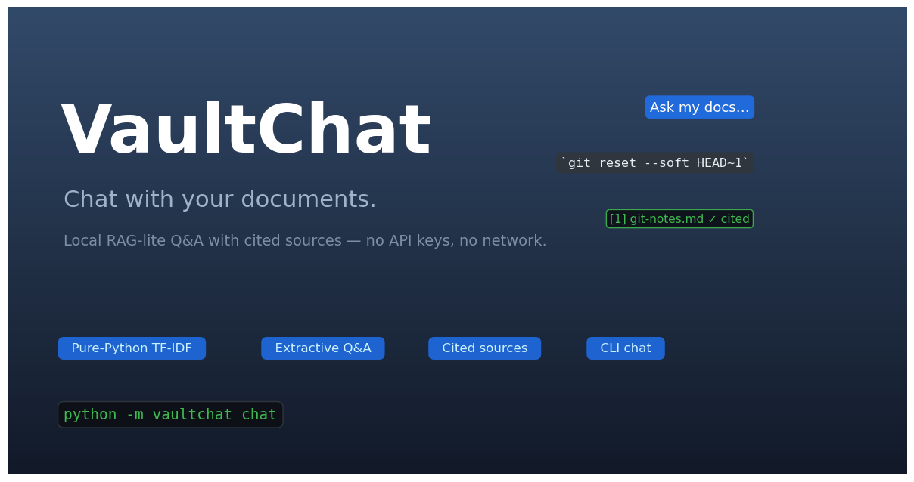
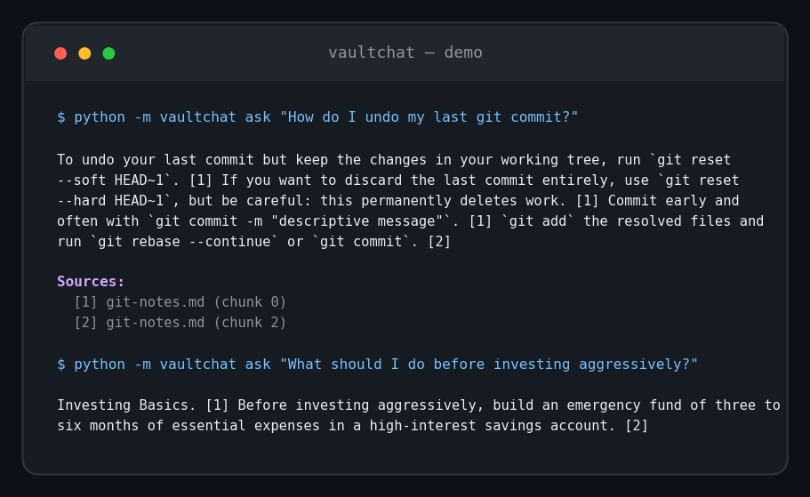

# VaultChat 💬

**Chat with your documents — local RAG-lite Q&A with cited sources, no API keys, no network.**




Drop your markdown and text notes into a folder, and VaultChat answers questions about them — every claim cited to the exact document and chunk it came from. Everything runs locally on your machine: no accounts, no API keys, no data ever leaves your laptop.

## Demo

Real output from the bundled sample docs:



## Features

- 📥 **Ingest** — reads `.md`/`.txt` files from any folder and chunks them into passages with configurable overlap, so context never gets cut mid-thought.
- 🔍 **Pure-Python TF-IDF retrieval** — term frequency–inverse document frequency plus cosine similarity, implemented from scratch with the standard library. Zero heavy dependencies.
- ✂️ **Extractive Q&A** — retrieves the top-k chunks, extracts the most relevant sentences, and composes an answer where every sentence carries an inline citation like `[1]`.
- 📚 **Cited sources** — every answer ends with a source list (`git-notes.md (chunk 0)`), so any claim is one click away from verification.
- 💻 **CLI chat loop** — `python -m vaultchat chat` for interactive sessions, plus a one-shot `ask` command for scripting and pipelines.
- 🧪 **Tested** — 28 tests covering chunking, retrieval ranking, answer extraction, and the CLI end-to-end.
- 🔒 **Private by design** — no network calls, no API keys, no telemetry. Your documents stay yours.

## Tech stack

| Layer | Choice |
|---|---|
| Language | Python 3.10+ (stdlib only — no numpy, no sklearn) |
| Retrieval | Hand-rolled TF-IDF + cosine similarity (`vaultchat/retrieval.py`) |
| Q&A | Extractive sentence selection with query-term overlap scoring (`vaultchat/answer.py`) |
| CLI | `argparse`-based `chat` / `ask` commands (`vaultchat/cli.py`) |
| Tests | `pytest` |

## Quickstart

```bash
# 1. Clone and enter the repo
git clone https://github.com/872000/vaultchat.git
cd vaultchat

# 2. (Optional) install the test runner
pip install pytest

# 3. Ask a question about the bundled sample docs — works immediately
python -m vaultchat ask "How do I undo my last git commit?"

# 4. Or start an interactive chat session
python -m vaultchat chat

# 5. Run the test suite
python -m pytest
```

**Use your own documents:** point VaultChat at any folder of markdown/text files.

```bash
python -m vaultchat --docs ~/my-notes ask "What did I write about caching?"
python -m vaultchat --docs ~/my-notes chat
```

## Project structure

```
vaultchat/
├── vaultchat/
│   ├── __init__.py      # package version + metadata
│   ├── __main__.py      # `python -m vaultchat` entry point
│   ├── cli.py           # `chat` loop and one-shot `ask` command
│   ├── ingest.py        # load .md/.txt docs, markdown cleanup, chunking with overlap
│   ├── retrieval.py     # tokenizer, TF-IDF index, cosine-similarity search
│   └── answer.py        # extractive Q&A: sentence scoring + citations
├── tests/
│   ├── test_ingest.py
│   ├── test_retrieval.py
│   ├── test_answer.py
│   └── test_cli.py
├── data/
│   └── docs/            # bundled sample documents (Python, git, finance, handbook, interview prep)
├── docs/
│   └── images/          # hero banner + real demo screenshot
├── README.md
├── LICENSE
└── .gitignore
```

## How it works

1. **Ingest** — documents are cleaned (markdown headings become sentences) and split into ~120-word chunks with 30-word overlap.
2. **Index** — each chunk becomes a TF-IDF vector: term frequency normalized by chunk length, weighted by inverse document frequency across the corpus.
3. **Retrieve** — your question is vectorized the same way and ranked against chunks by cosine similarity; the top-k win.
4. **Answer** — candidate sentences from those chunks are scored by query-term overlap, the best are picked (deduplicated), and each gets an inline citation pointing at its source chunk.

## Roadmap

- [ ] Persisted index (build once, query fast on large doc sets)
- [ ] PDF and HTML ingestion
- [ ] Hybrid retrieval: BM25-style scoring + phrase matching
- [ ] Web UI (single-page chat interface)
- [ ] Conversation memory across chat turns
- [ ] Export answers to markdown with full citation links

## License

MIT — see [LICENSE](LICENSE).
